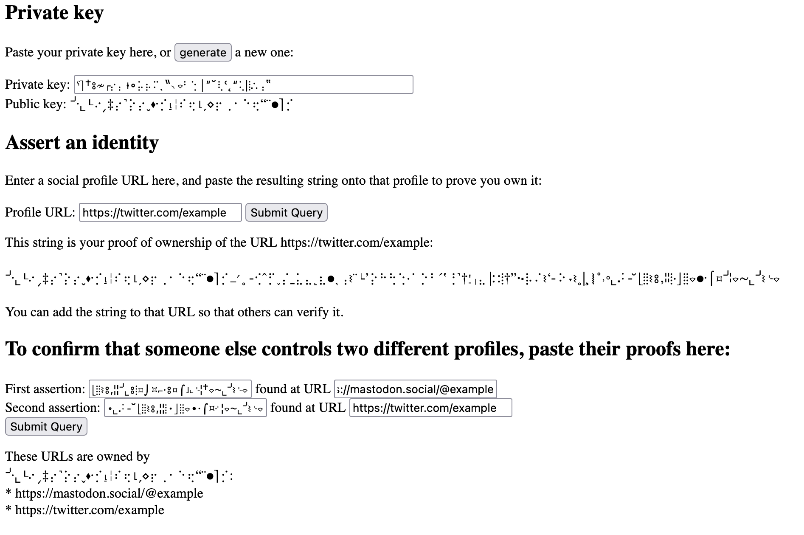

# SparkleID

[view index.html on github pages](https://jcushman.github.io/sparkleid/)

This is an experiment to see what it looks like to do a minimal equivalent of the service
provided by Keybase -- linking social accounts by placing a signed proof on each of them
of control of a private key. The index.html file loads a hashed copy of TweetNACL and
provides key generation, signing, and verification.

With a little extra effort the signing key could be converted to an encryption key and used
for messaging as well, though I didn't include that in this proof of concept.

**This is not for anything!** I don't think it solves a useful problem and don't claim it's secure.
I was just curious what it would look like, and thought it was fun that a minimal version could fit in
a couple hundred lines of JS plus a short, audited crypto library.

## Example

## Encoding format

The most fun part might be the base256 encoding format, which uses unicode punctuation
to encode 32-byte integer arrays as strings of little dots and lines instead of base64:

> ahwdGixznb9LNb1wM8R40Uyf0gKc/C5fUHqMCUmLmUI= -> 
> ⌊ˋˊˍ"⌁┎༜‶΅༚⌐´￪⋄꧇‷⬩⸰˺┍՝º⍪⏐∼╶ˬ‧╵┖†
> /JKMDYUpeMl0TDI+Xmfr25VRSD8BcV1Y+lqw31Vutys= -> 
> ՝╮╶˚∙ʺ⋄⨽⦁‷¯“⍳⌔፣⳿╎⏑…”˻⌑⍸⎼՛⎮꠷⁃⎹⌎⌯`
> bqrql3FL8G/2Gr34tPrnQeVNUAVroCog4HBMxzl9Mlg= ->
> ⌎✧᛭┚⌑‶፡⌏॰ˍ༚߹⑀՛᠄‟᠂‸⏐˴⌋⬪ʹˇ‾⌐‷⫶‗∿¯⎼
> 7R/dL4UYQomadazLnBsJNkv7UTfjY3P/o2rJTa+Ut48= -> 
> ፥ˈ⁚¸∙ˏ†▫┑⦂⚘⟊┍ˌˬ΄‶՜⏑ͺ᭝⌞⌁։⬞⌊⨽‸꠶╰⌯╹
> UAKC+NGF/Ci330jweaYO1Mgak/n105KiqfNNjO/nq4A= -> 
> ⏐˺∶߹꧇∙՝ʻ⌯⁃…፡⋅❳˙⸀⨼ˍ╯՚૰⸒╮⬝❘་‸╶፧᠄⚬∴> 

This results in nonsense strings that are larger on a byte-encoding level but lighter to see on a social profile.

Like the whole concept, this is probably not a great idea.

## More useful alternatives

The simplest alternative for linking social accounts is to have some hub that handles the association,
like LinkTree or LittleLink, with `rel="me"` bidirectional connections between the hub and each spoke.
That proves the same thing (a shared identity in control of all the relevant pages), but with no cryptography
to mess with.

Or, [keys.pub](https://keys.pub/) is doing a more fleshed out version of the signed-ownership-statement concept, taking into
account things like key management and revocation, which is where the tricky bits are.
